# Communiti
Open lending marketplace for small businesses

1.Home Page Of the Application 

2.Borrower Registration window(Click _Register as aa business_ in Home Page )

3.Borrower requesting Loan

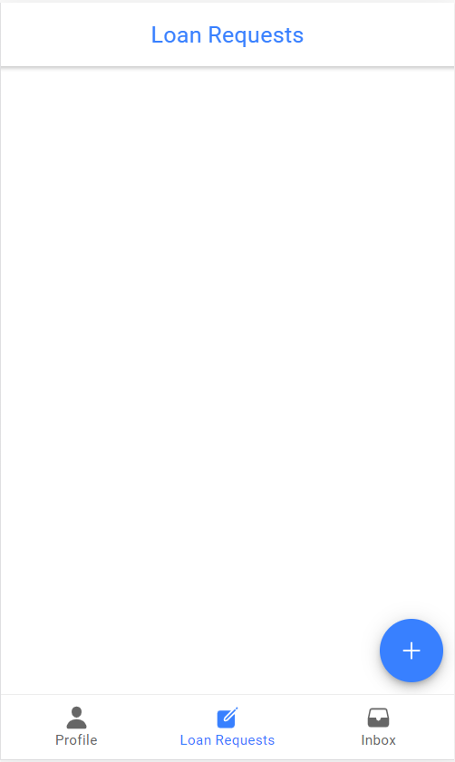
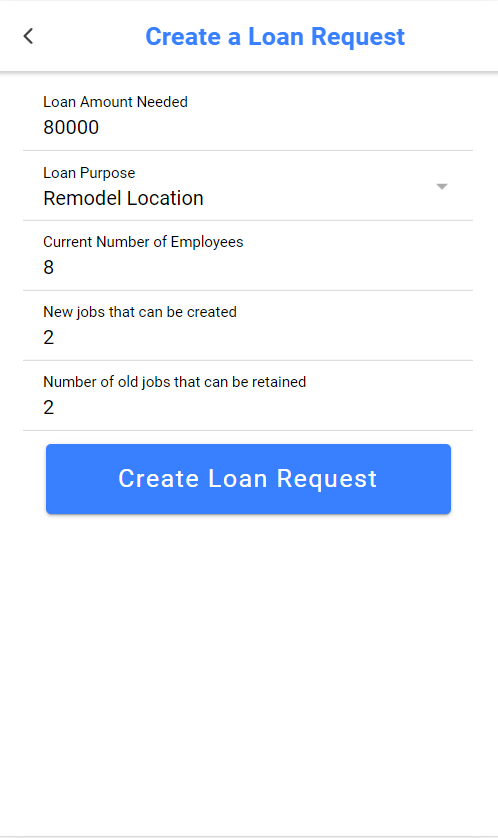
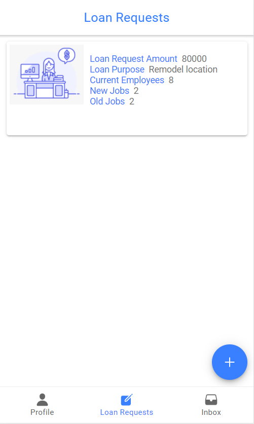

4.LenderRegistration

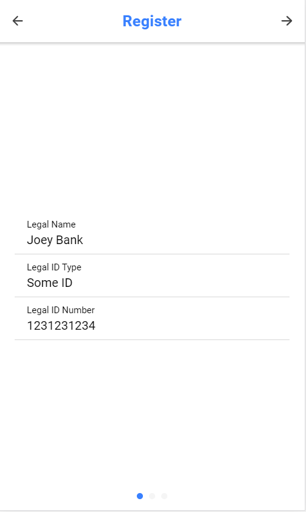
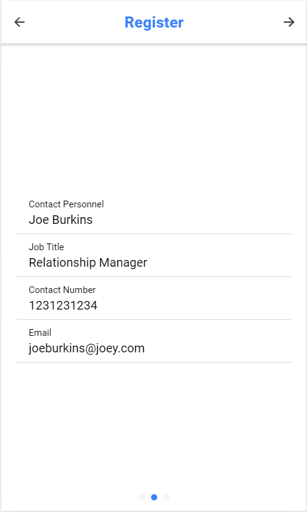
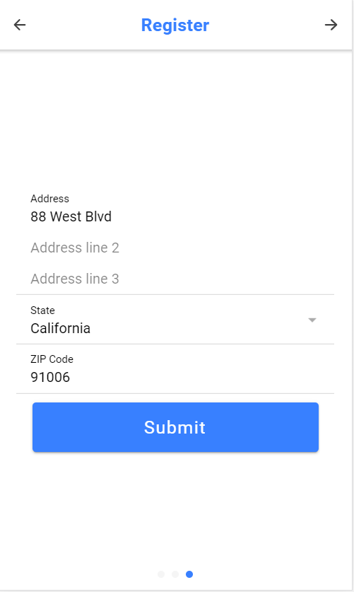

5.Lender making bid

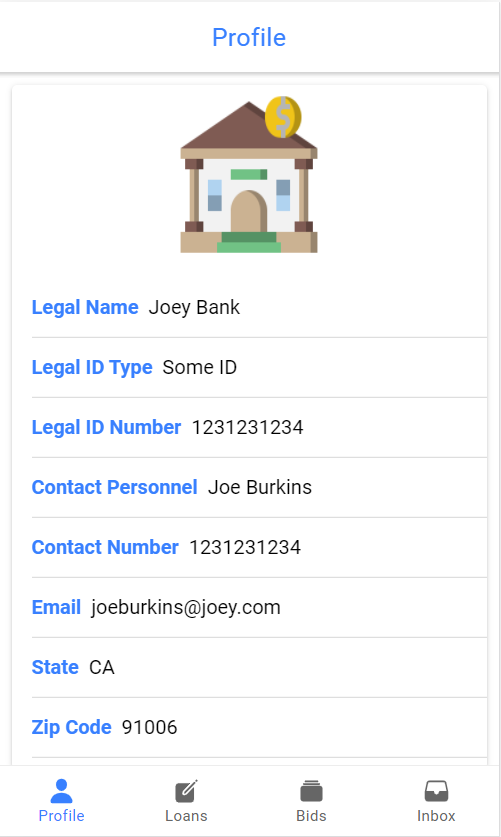
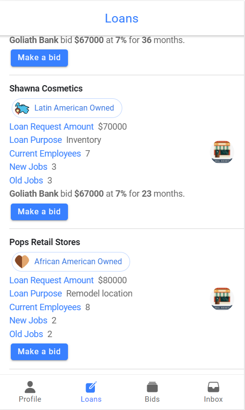
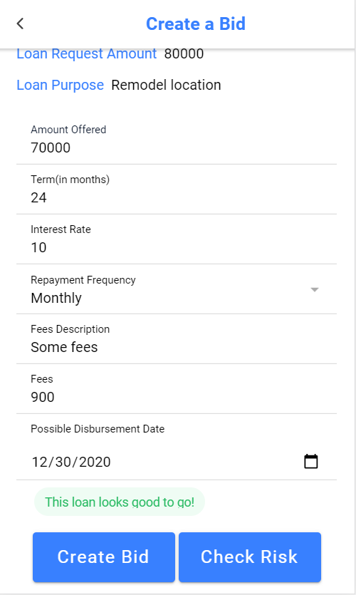

6.Accept/Decline bid by Borrower

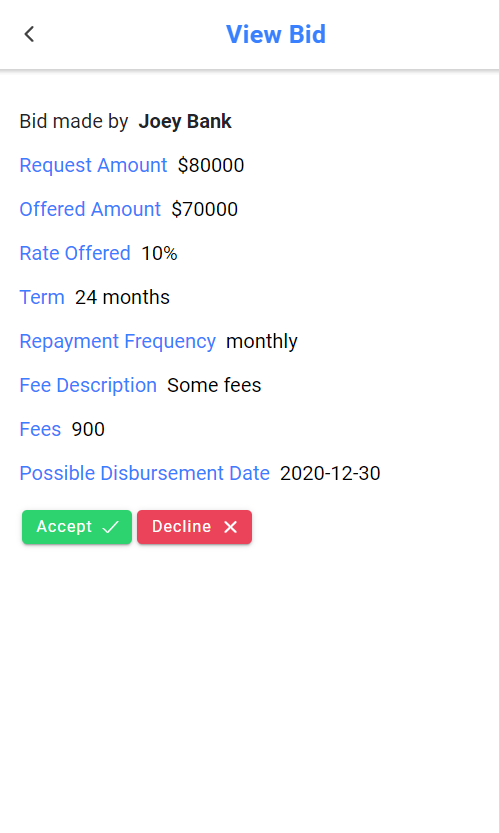
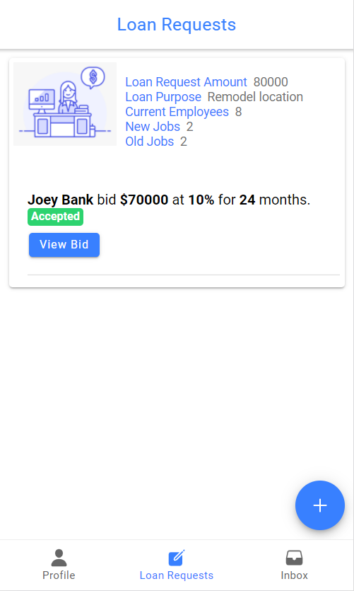
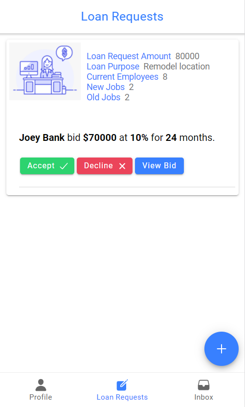

7. Lender Inbox

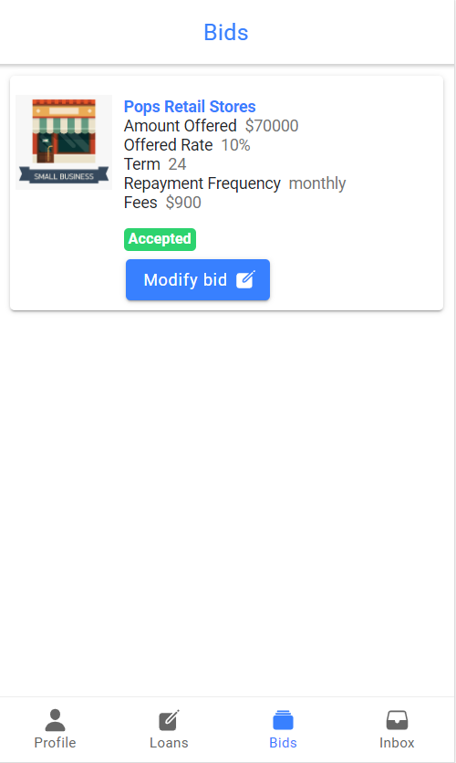
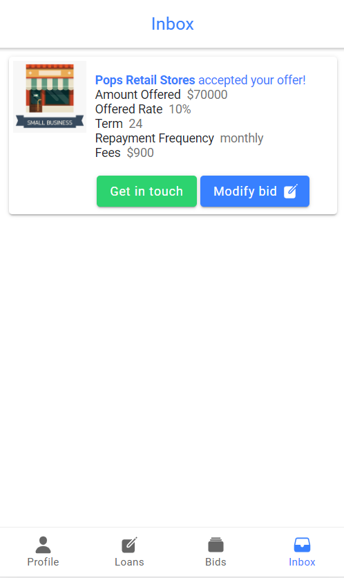

