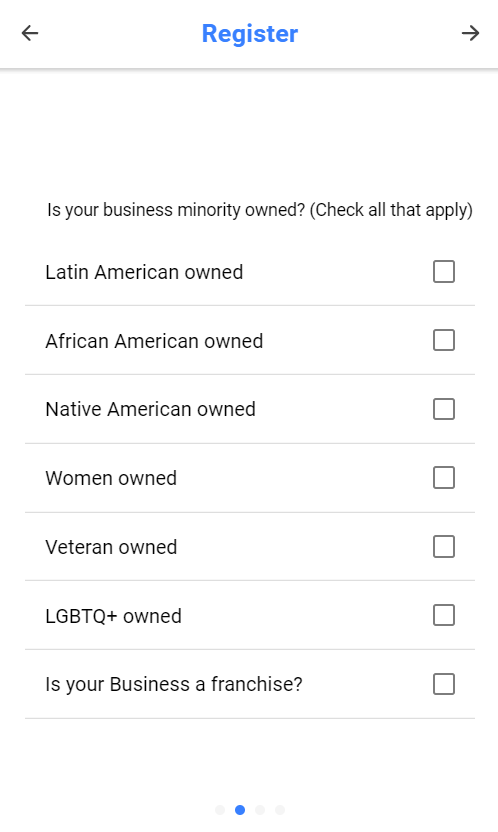

# Communiti
Open lending marketplace for small businesses

1.Home Page Of the Application 

2. Borrower Registration window(Click _Register as aa business_ in Home Page )

3. Borrower requesting Loan

4. LenderRegistration

5.Lender making bid

6. Accept/Decline bid by Borrower

7. Bid Status for Lender

